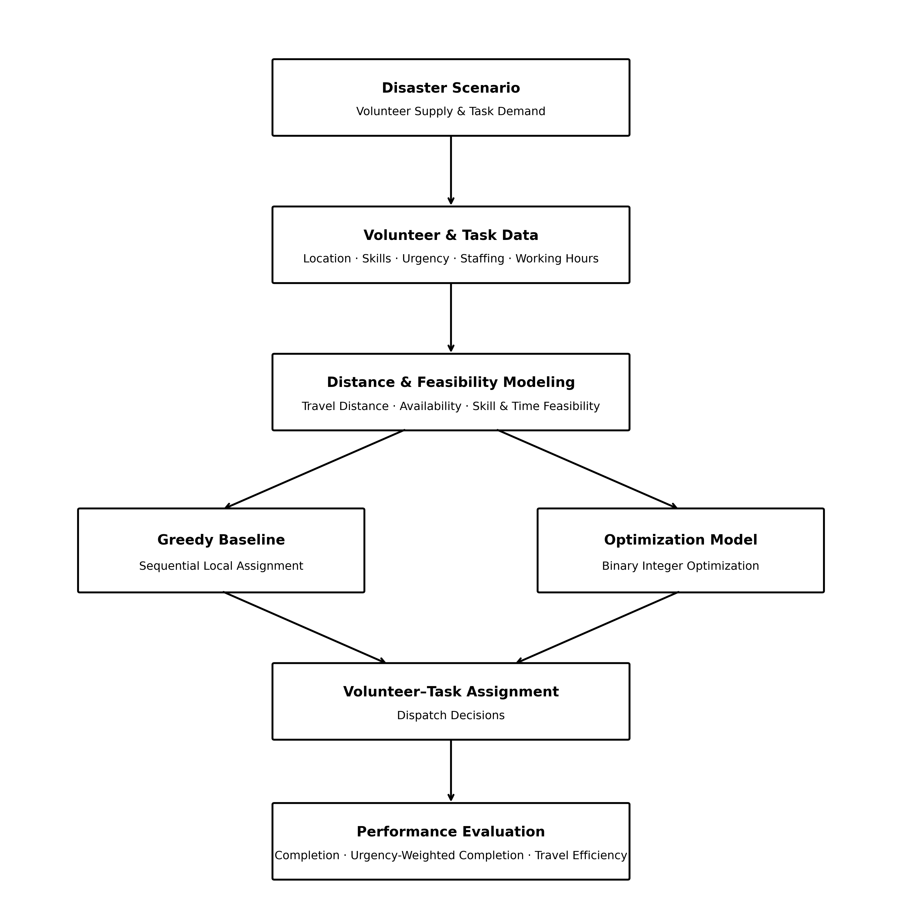
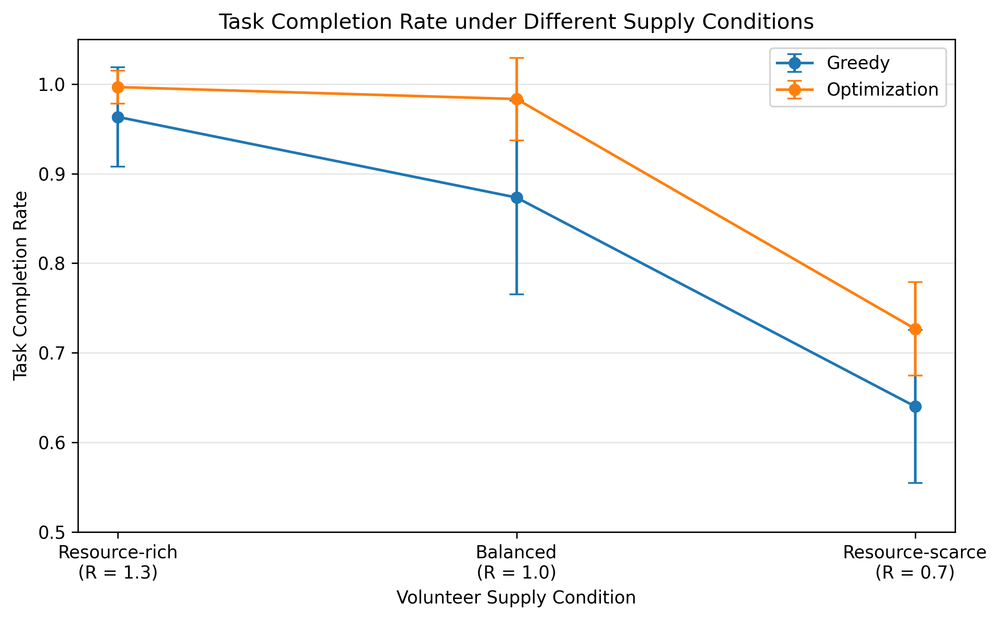
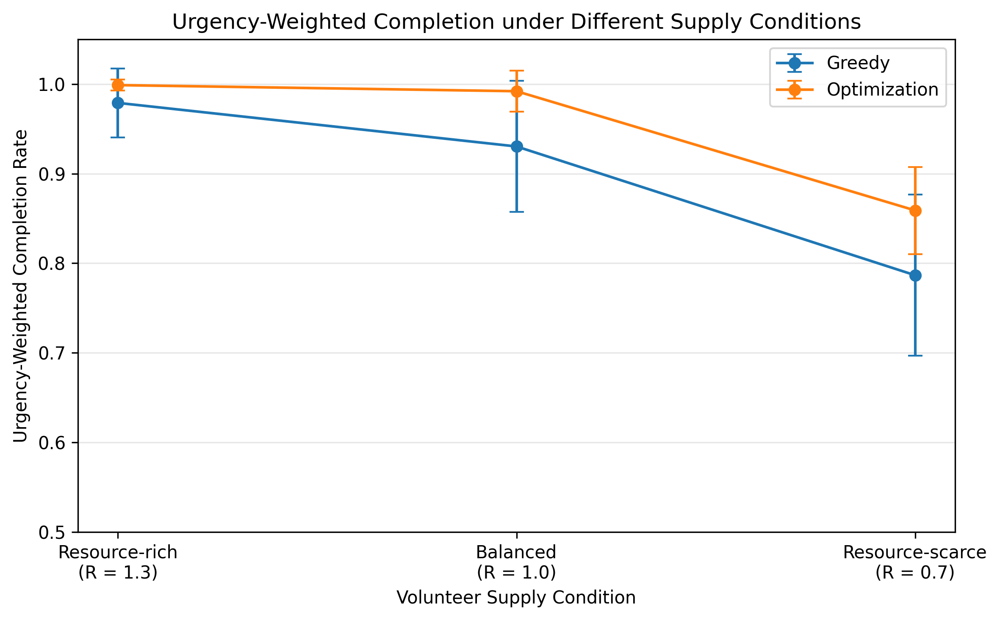
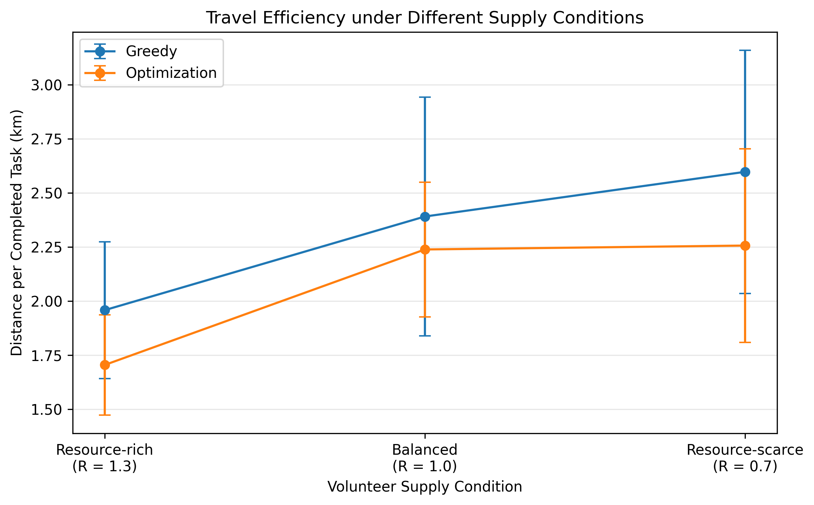
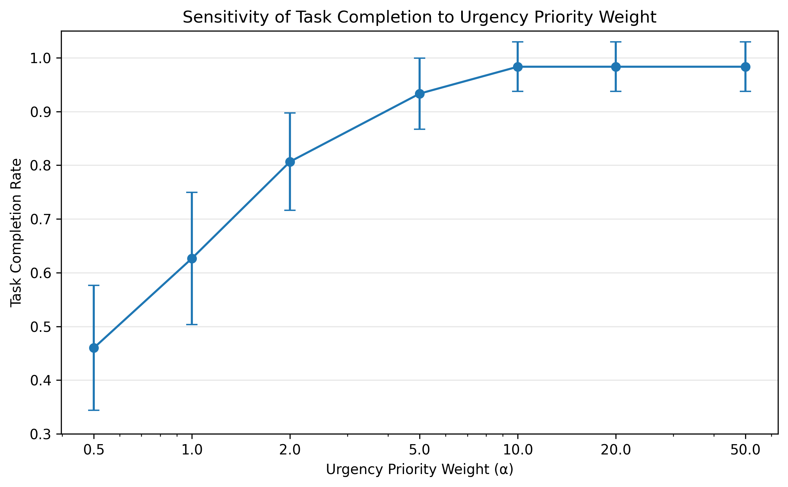
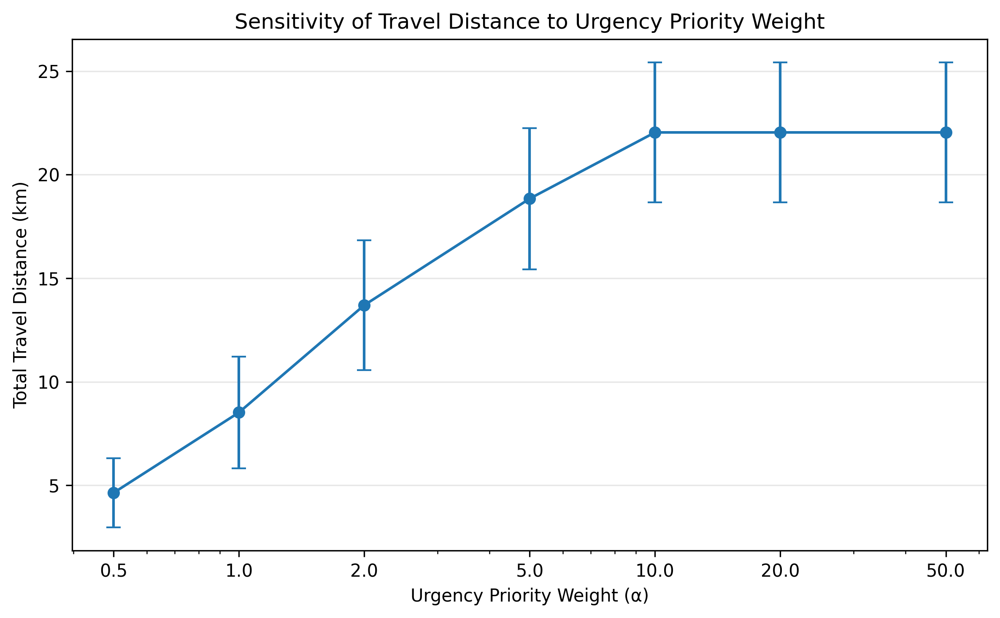
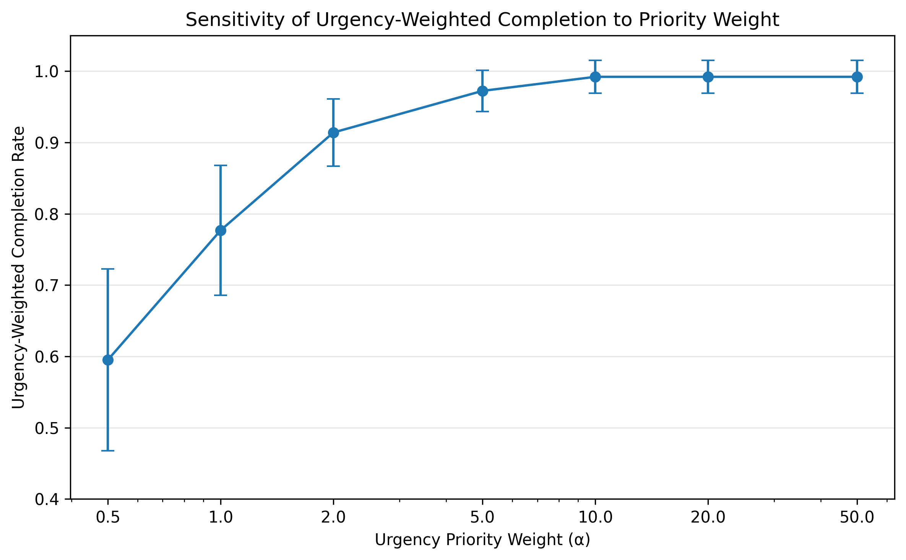

# Disaster Volunteer Dispatch and Resource Allocation Optimization

> An optimization-based decision framework for allocating limited volunteers to disaster-response tasks under urgency, skill, staffing, and travel constraints.

## Overview

During post-disaster response, volunteer resources are often limited while multiple tasks compete for immediate assistance. Simple dispatch rules, such as assigning the nearest available volunteer to the most urgent task, may produce locally reasonable decisions but lead to inefficient resource allocation at the system level.

This project formulates disaster volunteer dispatch as a binary integer optimization problem. The model jointly considers task urgency, volunteer availability, staffing requirements, skill coverage, working-time feasibility, and travel distance to determine volunteer-task assignments.

A greedy dispatch strategy is implemented as a baseline and compared with the optimization model under resource-rich, balanced, and resource-scarce conditions. Multi-instance experiments and sensitivity analysis are used to evaluate solution effectiveness, travel efficiency, and the trade-off between service priority and travel cost.

---

## Motivation

Disaster-response platforms can collect reports, visualize affected areas, and coordinate volunteers, but identifying available resources does not by itself determine how those resources should be allocated.

When several tasks simultaneously compete for limited volunteers, dispatch decisions must consider multiple factors:

- Which tasks should be prioritized?
- Which volunteers satisfy the required skills?
- How should limited personnel be distributed across competing tasks?
- How can unnecessary travel be reduced without sacrificing critical task coverage?

This project explores how operations research and optimization can transform disaster-response information into actionable allocation decisions.

---

## Problem Formulation

Given a set of available volunteers and disaster-response tasks, the objective is to determine which volunteers should be assigned to which tasks while balancing service priority and travel cost.

Each volunteer is characterized by:

- location
- availability
- maximum working hours
- first-aid capability
- driving capability
- heavy-lifting capability

Each task is characterized by:

- location
- urgency level
- required number of volunteers
- service duration
- required skill coverage

The resulting decision problem can be summarized as:

> **Who should be assigned to which task, under operational constraints, to maximize high-priority task completion while controlling travel cost?**

---

## Method Overview

The workflow converts disaster-response information into volunteer-task allocation decisions and evaluates the resulting dispatch performance.

<p align="center">
  
</p>

The same generated problem instances are evaluated using two dispatch approaches:

1. **Greedy baseline** — tasks are processed by urgency and volunteers are assigned sequentially using local feasibility and distance information.
2. **Optimization model** — volunteer-task assignments are determined globally through binary integer optimization.

---

## Mathematical Model

The dispatch problem is formulated as a binary integer optimization model.

### Decision Variables

Let:

- \(x_{ij}=1\) if volunteer \(i\) is assigned to task \(j\), and 0 otherwise.
- \(y_j=1\) if task \(j\) is fully completed, and 0 otherwise.

### Objective

The model balances urgency-weighted task completion against volunteer travel distance:

$$
\max \quad
\alpha \sum_{j \in J} u_j y_j
-
\beta \sum_{i \in I}\sum_{j \in J} d_{ij}x_{ij}
$$

where:

- \(u_j\): urgency of task \(j\)
- \(d_{ij}\): travel distance from volunteer \(i\) to task \(j\)
- \(\alpha\): urgency-priority weight
- \(\beta\): travel-cost weight

The baseline experiments use \(\alpha=10\) and \(\beta=1\), with the choice of \(\alpha\) further examined through sensitivity analysis.

### Key Constraints

The optimization model ensures that:

1. **Volunteer capacity:** each volunteer is assigned to at most one task.
2. **Availability:** unavailable volunteers cannot be assigned.
3. **Working-time feasibility:** a volunteer can only perform tasks within their available working hours.
4. **Staffing requirement:** a completed task must receive its required number of volunteers.
5. **Skill coverage:** completed tasks must include volunteers satisfying required first-aid, driving, or heavy-lifting capabilities.

For the complete mathematical formulation, see [`docs/mathematical_model.md`](docs/mathematical_model.md).

---

## Experimental Design

To evaluate the dispatch strategies under different levels of volunteer availability, synthetic disaster-response instances were generated under three relative volunteer-supply conditions:

| Scenario | Relative Supply Level \(R\) | Description |
|---|---:|---|
| Resource-rich | 1.3 | Higher volunteer availability |
| Balanced | 1.0 | Baseline volunteer availability |
| Resource-scarce | 0.7 | Lower volunteer availability |

For each supply condition, 30 problem instances were generated and evaluated using both the greedy baseline and the optimization model, resulting in 180 method-instance evaluations.

Both methods were tested on the same generated instances to ensure a controlled comparison.

### Evaluation Metrics

Performance was evaluated using:

- **Task Completion Rate** — proportion of tasks that received all required volunteers.
- **Urgency-Weighted Completion** — proportion of total task urgency represented by completed tasks.
- **Travel Efficiency** — travel distance per completed task, which accounts for differences in the number of tasks successfully served.

Mean performance and standard deviation across the 30 instances were reported for each scenario and method.

---

## Results

The optimization model consistently achieved higher task completion and urgency-weighted completion than the greedy baseline across all three volunteer supply conditions.

### Task Completion

<p align="center">
  
</p>

The advantage of global optimization became more pronounced as volunteer resources became constrained. Under the resource-scarce condition, the mean task completion rate increased from **64.00% with Greedy to 72.67% with Optimization**. Under the balanced condition, completion increased from **87.33% to 98.33%**.

### Urgency-Weighted Completion

<p align="center">
  
</p>

The optimization model also preserved a larger share of high-priority task demand. Under resource scarcity, urgency-weighted completion increased from **78.66% to 85.89%**, indicating that the optimization model allocated limited volunteers more effectively toward important tasks.

### Travel Efficiency

<p align="center">
  
</p>

Because total travel distance is affected by how many tasks are successfully completed, travel efficiency was evaluated using distance per completed task.

Optimization achieved lower mean distance per completed task in all three scenarios:

| Scenario | Greedy | Optimization | Improvement |
|---|---:|---:|---:|
| Resource-rich | 1.958 km | 1.705 km | 12.9% |
| Balanced | 2.391 km | 2.239 km | 6.4% |
| Resource-scarce | 2.597 km | 2.257 km | 13.1% |

These results show that the higher completion performance of the optimization model was not achieved simply by using travel resources inefficiently. Instead, the model generally completed more tasks while requiring less travel distance per completed task.

> **Why not compare total distance alone?**  
> A method that completes fewer tasks may naturally produce a lower total travel distance simply because fewer volunteers are dispatched. Therefore, distance per completed task is used as the primary travel-efficiency metric when comparing methods with different completion levels.

---

## Sensitivity Analysis

The objective-function priority weight \(\alpha\) controls the trade-off between urgency-weighted task completion and travel cost.

A sensitivity analysis was conducted using:

\[
\alpha \in \{0.5, 1, 2, 5, 10, 20, 50\}
\]

while fixing \(\beta=1\).

### Task Completion

<p align="center">
  
</p>

### Travel Distance

<p align="center">
  
</p>

### Urgency-Weighted Completion

<p align="center">
  
</p>

As the urgency-priority weight increased, task completion improved at the cost of additional travel. Mean task completion increased from **46.00% at \(\alpha=0.5\)** to **98.33% at \(\alpha=10\)**, while urgency-weighted completion increased from **59.51% to 99.21%**.

Performance reached a plateau at \(\alpha=10\). Values of 10, 20, and 50 produced identical average completion, urgency-weighted completion, and travel-distance results.

Therefore, \(\alpha=10\) was selected as the baseline because it was the smallest tested value that reached the observed performance plateau within the tested parameter range and balanced synthetic scenarios.

---

## Key Findings

1. **Global optimization improves task coverage.**  
   The optimization model achieved higher mean task completion than the greedy baseline across resource-rich, balanced, and resource-scarce conditions.

2. **The benefit becomes especially important when resources are constrained.**  
   Under resource scarcity, optimization increased mean task completion from 64.00% to 72.67% and urgency-weighted completion from 78.66% to 85.89%.

3. **Optimization improves travel efficiency despite higher task coverage.**  
   Although optimization may dispatch more volunteers and therefore increase total travel in some scenarios, it achieved lower travel distance per completed task across all tested supply conditions.

4. **The objective exhibits a clear service-cost trade-off.**  
   Increasing the urgency-priority weight improved task coverage while increasing travel cost, with performance reaching an observed plateau at \(\alpha=10\) among the tested values.

---

## Project Structure

```text
disaster-volunteer-optimization/
├── README.md
├── requirements.txt
│
├── data/
│   ├── volunteers.csv
│   ├── tasks.csv
│   └── distance_matrix.csv
│
├── docs/
│   ├── figures/
│   │   └── method_overview.png
│   ├── problem_definition.md
│   ├── data_model.md
│   ├── baseline_method.md
│   ├── mathematical_model.md
│   └── experiment_design.md
│
├── src/
│   ├── compute_distance_matrix.py
│   ├── baseline_greedy.py
│   ├── optimization_model.py
│   ├── compare_methods.py
│   ├── generate_scenarios.py
│   ├── visualize_results.py
│   ├── visualize_sensitivity.py
│   └── visualize_method.py
│
├── experiments/
│   ├── run_multi_scenario.py
│   └── run_sensitivity_analysis.py
│
└── results/
    ├── multi_scenario/
    ├── sensitivity/
    └── figures/
```

Detailed experiment outputs and generated figures are stored under the `results/` directory.

---

## Technology Stack

- **Python** — data processing, experimentation, and visualization
- **Pandas** — structured volunteer, task, and experimental data processing
- **OR-Tools (SCIP)** — binary integer optimization
- **Matplotlib** — experimental result visualization

---

## How to Run

### 1. Clone the Repository

Clone this repository and navigate to the project directory:

```bash
git clone https://github.com/yxin214/disaster-volunteer-optimization.git
cd disaster-volunteer-optimization
```

### 2. Install Dependencies

Install the required Python packages:

```bash
pip install -r requirements.txt
```

### 3. Generate the Distance Matrix

Compute the pairwise travel distances between volunteers and disaster-response tasks:

```bash
python src/compute_distance_matrix.py
```

The generated distance matrix will be saved to:

```text
data/distance_matrix.csv
```

### 4. Run the Greedy Baseline

Run the urgency-prioritized greedy dispatch method:

```bash
python src/baseline_greedy.py
```

The resulting assignments and task-level evaluation will be saved in the `results/` directory.

### 5. Run the Optimization Model

Solve the volunteer-task allocation problem using the binary integer optimization model:

```bash
python src/optimization_model.py
```

The optimized volunteer-task assignments will be saved to:

```text
results/optimization_assignment.csv
```

### 6. Compare Greedy and Optimization Methods

Generate a direct comparison between the greedy baseline and optimization model:

```bash
python src/compare_methods.py
```

The comparison results will be saved to:

```text
results/method_comparison.csv
results/task_level_comparison.csv
```

### 7. Run Multi-Scenario Experiments

Evaluate both dispatch methods under resource-rich, balanced, and resource-scarce volunteer supply conditions:

```bash
python experiments/run_multi_scenario.py
```

The experiment results will be saved to:

```text
results/multi_scenario/
```

### 8. Generate Multi-Scenario Figures

Generate the main performance comparison figures:

```bash
python src/visualize_results.py
```

The generated figures will be saved to:

```text
results/figures/
```

### 9. Run Objective-Weight Sensitivity Analysis

Evaluate the effect of different urgency-priority weights on the optimization model:

```bash
python experiments/run_sensitivity_analysis.py
```

The sensitivity-analysis results will be saved to:

```text
results/sensitivity/
```

### 10. Generate Sensitivity Figures

Generate figures showing the trade-off between task completion, urgency-weighted completion, and travel cost under different objective weights:

```bash
python src/visualize_sensitivity.py
```

The generated figures will be saved to:

```text
results/figures/sensitivity/
```

### 11. Generate the Method Overview Figure

Regenerate the project workflow diagram used in this README:

```bash
python src/visualize_method.py
```

The generated figure will be saved to:

```text
docs/figures/method_overview.png
```

---

## Limitations and Future Work

This project focuses on validating the optimization framework in controlled synthetic disaster-response scenarios. Several extensions are required before deployment in real-world disaster operations.

Current limitations include:

- **Synthetic problem instances:** volunteer and task data are generated for controlled experimental evaluation rather than collected from actual disaster operations.
- **Static dispatch decisions:** the current model assumes that volunteer availability and task demand are known when optimization is performed.
- **Simplified travel cost:** geographic distance is used as the travel-cost approximation and does not account for damaged roads, congestion, or changing accessibility.
- **Deterministic information:** uncertainty in task duration, volunteer arrival time, and evolving disaster conditions is not explicitly modeled.

Future work could extend the framework toward:

- real-world disaster-response datasets and GIS road-network travel times,
- dynamic re-optimization as new tasks and volunteers arrive,
- stochastic or robust optimization under uncertain information,
- multi-period volunteer scheduling and workload balancing,
- integration with disaster-response platforms for decision-support applications.